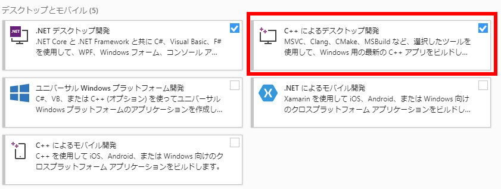

# エラー対処

[トップへ](./../../index.md)

## 各エラーへの対処

#### ビルド時にエラーが出る (頻繁に遭遇)
エディタ拡張をいじる場合、UnityEditorはビルド時にはusing出来ないため#if UNITY_EDITORで囲まないとエラーになる。

エディタ拡張時はこまめにビルドしてエラーになっていないか確認しよう。

#### il2cpp.exe did not run properly! と出る (2021/5/23 Unity 2019.4.24f1で遭遇)
[こちらのページ](https://moon-bear.com/2020/10/27/unity-il2cpp-build/)を参照。

比較的新しめのUnityだとコンパイルにIL2CPPという仕組みを使うのだが、
C++コンパイラがVisual Studioに入っていないとエラーが出る。

Visual Studioインストーラーを開き、「変更」→「C++によるデスクトップ開発」にチェックを入れてコンパイラをインストールする。

